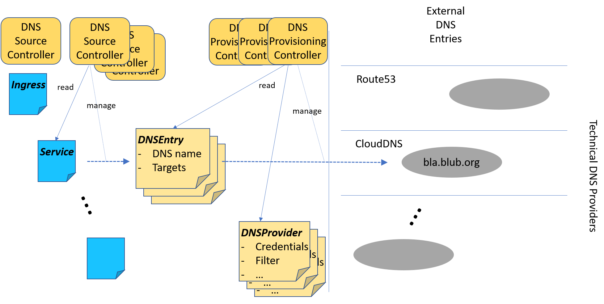

# External DNS Management

This project offers an environment to manage external DNS entries for
a kubernetes cluster. It provides a flexible model allowing to
add DNS source objects and DNS provisioning environments by adding
new independent controllers.

## The Model

There is no single DNS controller anymore. The decoupling between the
handling of DNS source objects, like ingresses or services, and the
provisioning of DNS entries in an external DNS provider like
_Route53_ or _CloudDNS_ is achieved by introducing a new custom resource
`DNSEntry`.

These objects can either be explicitly created to request dedicated DNS
entries, or they are managed based on other resources like ingresses or
services. For the latter dedicated _DNS Source Controllers_ are used.
There might be any number of such source controllers. They do not need to know
anything about the various DNS environments. Their task is to figure out which
DNS entries are required in their realm and manage appropriate `DNSEntry`
objects. From these objects they can also read the provisioning status and
report it back to the original source.



Provisioning of DNS entries in external DNS providers is done by
_DNS Provisioning Controllers_. They don't need to know anything about the
various DNS source objects. They watch `DNSEntry` objects and check whether
they are responsible for such an object. If a provisioning controller feels
responsible for an entry it manages the corresponding settings in the
external DNS environment and reports the provisioning status back to the
corresponding `DNSEntry` object.

To do this a provisioning controller is responsible for a dedicated
environment (for example Route53). For every such environment the controller
uses a dedicated _type_ key. This key is used to look for `DNSProvider` objects.
There might be multiple such objects per environment, specifying the
credentials needed to access different external accounts. These accounts are then
scanned for DNS zones and domain names they support.
This information is then used to dynamically assign `DNSEntry` objects to
dedicated `DNSProvider` objects. If such an assignment can be done by
a provisioning controller then it is _responsible_ for this entry and manages
the corresponding entries in the external environment.
`DNSProvider` objects can specify explicit inclusion and exclusion sets of domain names
and/or DNS zone identifiers to override the scanning results of the account.

### Owner Identifiers

Every DNS Provisioning Controller is responsible for a set of _Owner Identifiers_.
DNS records in an external DNS environment are attached to such an identifier.
This is used to identify the records in the DNS environment managed by a dedicated
controller (manager). Every controller manager hosting DNS Provisioning Controllers
offers an option to specify a default identifier. Additionally there might
be dedicated `DNSOwner` objects that enable or disable additional owner ids.

Every `DNSEntry` object may specify a dedicated owner that is used to tag
the records in the DNS environment. A DNS provisioning controller only acts
of DNS entries it is responsible for. Other resources in the external DNS
environment are not touched at all.

This way it is possbible to
- identify records in the external DNS management environment that are managed
  by the actual controller instance
- distinguish different DNS source environments sharing the same hosted zones
  in the external management environment 
- cleanup unused entries, even if the whole resource set is already
  gone
- move the responsibility for dedicated sets of DNS entries among different
  kubernetes clusters or DNS source environments running different
  DNS Provisioning Controller without loosing the entries during the
  migration process.

**If multiple DNS controller instances have access to the same DNS zones, it is very important, that every instance uses a unique owner identifier! Otherwise the cleanup of stale DNS record will delete entries created by another instance if they use the same identifier.**

### DNS Classes

Multiple sets of controllers of the DNS ecosystem can run in parallel in
a kubernetes cluster working on different object set. They are separated by
using different _DNS Classes_. Adding a DNS class annotation to an object of the
DNS ecosytems assigns this object to such a dedicated set of DNS controllers.
This way it is possible to maintain clearly separated set of DNS objects in a
single kubernetes cluster.

## The Content

This project contains:

- The _API Group_ objects for `DNSEntry` and `DNSProvider`
- A library that can be used to implement _DNS Source Controllers_
- A library that can be used to implement _DNS Provisioning Controllers_
- Source controllers for Services and Ingresses based on annotations.
- Provisioning Controllers for _Amazon Route53_, _Google CloudDNS_, 
  _AliCloud DNS_, _Azure DNS_, and _OpenStack Designate_.
- A controller manager hosting all these controllers.

## How to implement Source Controllers

Based on the provided source controller library a source controller must
implement the [`source.DNSSource` interface](pkg/dns/source/interface.go) and
provide an appropriate creator function.

A source controller can be implemented following this example:

```go
package service

import (
	"github.com/gardener/controller-manager-library/pkg/resources"
	"github.com/gardener/external-dns-management/pkg/dns/source"
)

var _MAIN_RESOURCE = resources.NewGroupKind("core", "Service")

func init() {
	source.DNSSourceController(source.NewDNSSouceTypeForExtractor("service-dns", _MAIN_RESOURCE, GetTargets),nil).
		FinalizerDomain("dns.gardener.cloud").
		MustRegister(source.CONTROLLER_GROUP_DNS_SOURCES)
}
```

Complete examples can be found in the sub packages of `pkg/controller/source`.

## How to implement Provisioning Controllers

Provisioning controllers can be implemented based on the provisioning controller library
in this repository and must implement the
[`provider.DNSHandlerFactory` interface](pkg/dns/provider/interface.go).
This factory returns implementations of the [`provider.DNSHandler` interface](pkg/dns/provider/interface.go)
that does the effective work for a dedicated set of hosted zones.

These factories can be embedded into a final controller manager (the runnable
instance) in several ways:

- The factory can be used to create a dedicated controller.
  This controller can then be embedded into a controller manager, either in
  its own controller manger or together with other controllers.
- The factory can be added to a compound factory, able to handle multiple
  infrastructures. This one can then be used to create a dedicated controller,
  again.

### Embedding a Factory into a Controller

A provisioning controller can be implemented following this 
[example](pkg/controller/provider/aws/controller/controller.go):

```go
package controller

import (
	"github.com/gardener/external-dns-management/pkg/dns/provider"
)

const CONTROLLER_NAME = "route53-dns-controller"

func init() {
	provider.DNSController(CONTROLLER_NAME, &Factory{}).
		FinalizerDomain("dns.gardener.cloud").
		MustRegister(provider.CONTROLLER_GROUP_DNS_CONTROLLERS)
}
```

This controller can be embedded into a controller manager just by using
an [anonymous import](cmd/dns/main.go) of the controller package in the main package
of a dedicated controller manager.

Complete examples are available in the sub packages of `pkg/controller/provider`.
They also show a typical set of implementation structures that help
to structure the implementation of such controllers.

The provider implemented in this project always follow the same structure:
- the provider package contains the provider code
- the factory source file registers the factory at a default compound factory
- it contains a sub package `controller`, which contains the embedding of
  the factory into a dedicated controller

### Embedding a Factory into a Compound Factory

A provisioning controller based on a *Compound Factory* can be extended by
a new provider factory by registering this factory at the compound factory.
This could be done, for example,  by using the default compound factory provided
in package [`pkg/controller/provider/compound`](pkg/controller/provider/compound/factory.go) as shown
[here](pkg/controller/provider/aws/factory.go), where `NewHandler` is a function creating
a dedicated handler for a dedicated provider type:

```go

package aws

import (
	"github.com/gardener/external-dns-management/pkg/controller/provider/compound"
	"github.com/gardener/external-dns-management/pkg/dns/provider"
)

const TYPE_CODE = "aws-route53"

var Factory = provider.NewDNSHandlerFactory(TYPE_CODE, NewHandler)

func init() {
	compound.MustRegister(Factory)
}
```

The compound factory is then again embedded into a provisioning controller as shown
in the previous section (see the [`controller`sub package](pkg/controller/provider/compound/controller/controller.go)).

## Setting Up a Controller Manager

One or multiple controller packages can be bundled into a controller manager,
by implementing a main package like [this](cmd/dns/main.go):

```go
package main

import (
	"github.com/gardener/controller-manager-library/pkg/controllermanager"

	_ "github.com/<your conroller package>"
	...
)

func main() {
	controllermanager.Start("my-dns-controller-manager", "dns controller manager", "some description")
}
```

### Using the standard Compound Provisioning Controller

If the standard *Compound Provisioning Controller* should be used it is required
to additionally add the anonymous imports for the providers intended to be
embedded into the compound factory like [this](cmd/compound/main.go):

<details>
<summary><b>Example Coding</b></summary>

```go
package main

import (
	"fmt"
	"os"

	"github.com/gardener/controller-manager-library/pkg/controllermanager"


	_ "github.com/gardener/external-dns-management/pkg/controller/provider/compound/controller"
	_ "github.com/gardener/external-dns-management/pkg/controller/provider/<your provider>"
	...
)

func main() {
	controllermanager.Start("dns-controller-manager", "dns controller manager", "nothing")
}
```
</details>

### Multiple Cluster Support

The controller implementations provided in this project are prepared to work
with multiple clusters by using the features of the used controller manager
library.

The *DNS Source Controllers* support two clusters:
- the default cluster is used to scan for source objects
- the logical cluster `target` is used to maintain the `DNSEnry` objects.

The *DNS Provisioning Controllers* also support two clusters:
- the default cluster is used to scan for `DNSEntry` objects. It is mapped 
  to the logical cluster `target`
- the logical cluster `provider` is used to look to the `DNSProvider` objects
  and their related secrets.


If those controller types should be combined in a single controller manager,
it can be configured to support three potential clusters with the
source objects, the one for the entry objects and the one with provider
objects using cluster mappings.

This is shown in a complete [example](cmd/compound/main.go) using the dns
source controllers, the compound provisioning controller configured to
support all the included DNS provider type factories:

<details>
<summary><b>Example Coding</b></summary>

```go
package main

import (
	"fmt"
	"os"

	"github.com/gardener/controller-manager-library/pkg/controllermanager"
	"github.com/gardener/controller-manager-library/pkg/controllermanager/cluster"
	"github.com/gardener/controller-manager-library/pkg/controllermanager/controller"
	"github.com/gardener/controller-manager-library/pkg/controllermanager/controller/mappings"

	dnsprovider "github.com/gardener/external-dns-management/pkg/dns/provider"
	dnssource "github.com/gardener/external-dns-management/pkg/dns/source"

	_ "github.com/gardener/external-dns-management/pkg/controller/provider/compound/controller"
	_ "github.com/gardener/external-dns-management/pkg/controller/provider/alicloud"
	_ "github.com/gardener/external-dns-management/pkg/controller/provider/aws"
	_ "github.com/gardener/external-dns-management/pkg/controller/provider/azure"
	_ "github.com/gardener/external-dns-management/pkg/controller/provider/google"
	_ "github.com/gardener/external-dns-management/pkg/controller/provider/openstack"

	_ "github.com/gardener/external-dns-management/pkg/controller/source/ingress"
	_ "github.com/gardener/external-dns-management/pkg/controller/source/service"
)

func init() {
	// target cluster already defined in dns source controller package
	cluster.Configure(
		dnsprovider.PROVIDER_CLUSTER,
		"providers",
		"cluster to look for provider objects",
	).Fallback(dnssource.TARGET_CLUSTER)

	mappings.ForControllerGroup(dnsprovider.CONTROLLER_GROUP_DNS_CONTROLLERS).
		Map(controller.CLUSTER_MAIN, dnssource.TARGET_CLUSTER).MustRegister()

}

func main() {
	controllermanager.Start("dns-controller-manager", "dns controller manager", "nothing")
}
```
</details>

Those clusters can the be separated by registering their names together with
command line option names. These can be used to specify different kubeconfig 
files for those clusters.
  
By default all logical clusters are mapped to the default physical cluster
specified via `--kubeconfig` or default cluster access.

If multiple physical clusters are defined they can be specified by a
corresponding cluster option defining the kubeconfig file used to access
this cluster. If no such option is specified the default is used.

Therefore, even if the configuration is prepared for multiple clusters,
such a controller manager can easily work on a single cluster if no special
options are given on the command line.
