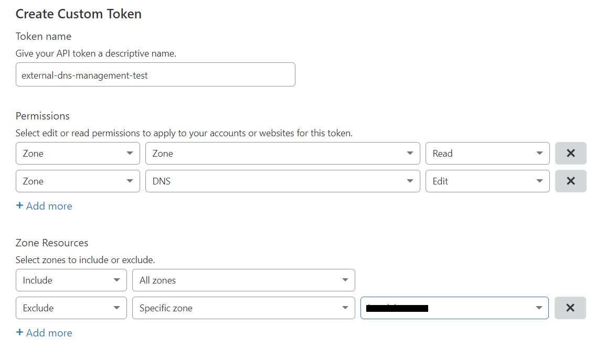

# Cloudflare DNS Provider

This DNS provider allows you to create and manage DNS entries in Cloudflare. 

## Generate API Tokens

To use this provider you need to generate an API token from the Cloudflare dashboard.
A detailed documentation to generate an API token is available at 
https://support.cloudflare.com/hc/en-us/articles/200167836-Managing-API-Tokens-and-Keys.

**Note: You need to generate an API token and not an API key.**

To generate the token make sure the token has permission of Zone:Read and DNS:Edit for 
all zones. Optionally you can exclude certain zones.

**Note: You need to `Include` `All zones` in the `Zone Resources` section. Setting 
`Specific zone` doesn't work. But you can still add one or more `Exclude`s.**



Generate the token and keep this key safe as it won't be shown again.

## Using the API Token

Create a `Secret` resource with the data field `apiToken`.
For legacy reasons, the field `CLOUDFLARE_API_TOKEN` is also supported. The value is the API token generated in the previous step. 

```yaml
apiVersion: v1
kind: Secret
metadata:
  name: cloudflare-credentials
  namespace: default
type: Opaque
stringData:
  apiToken: 1234567890123456789
``` 

## Troubleshooting

* If you get a permission error communicating with Cloudflare, be sure the domain name 
  being registered does not exceed your plan limits. Hierarchical domains are not
  supported on the free plan as of this writing.


## Routing Policy

The Cloudflare provider only supports the `proxied` routing policy to enable the Cloudflare proxy.

> [!NOTE]
> This is only implemented for the **next-generation** `dns-controller-manager` and not for the legacy `dns-controller-manager`.

### Proxied Routing Policy

The `proxied` routing policy enables the Cloudflare proxy for a DNS entry. This means that the DNS entry will be proxied through Cloudflare's network, providing additional security and performance benefits.
For details, please refer to the [Cloudflare documentation](https://developers.cloudflare.com/dns/proxy-status/).

Example:

```yaml
apiVersion: dns.gardener.cloud/v1alpha1
kind: DNSEntry
metadata:
  annotations:
    # If you are delegating the DNS management to Gardener Shoot DNS Service, uncomment the following line
    #dns.gardener.cloud/class: garden
  name: my-service
  namespace: default
spec:
  dnsName: "my.service.example.com"
  targets:
    - 1.2.3.4
  routingPolicy:
    type: proxied
    setIdentifier: proxied # "proxied" is mandatory for the proxied routing policy
    parameters: {} # empty parameters for the proxied routing policy 
```
