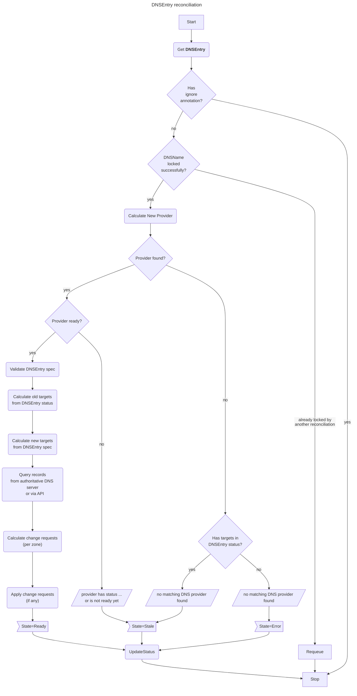

# `DNSEntry` reconciliation

The `reconcile` method in the code handles DNS entry reconciliation by:
1. Managing DNS provider selection and validation
2. Locking DNS names to prevent concurrent modifications
3. Calculating and comparing old vs new DNS targets
4. Applying necessary changes to DNS records
5. Updating the DNSEntry status based on the reconciliation results

It's part of a DNS controller that ensures DNS entries are properly managed through different DNS providers while handling state transitions, routing policies, and record updates.

