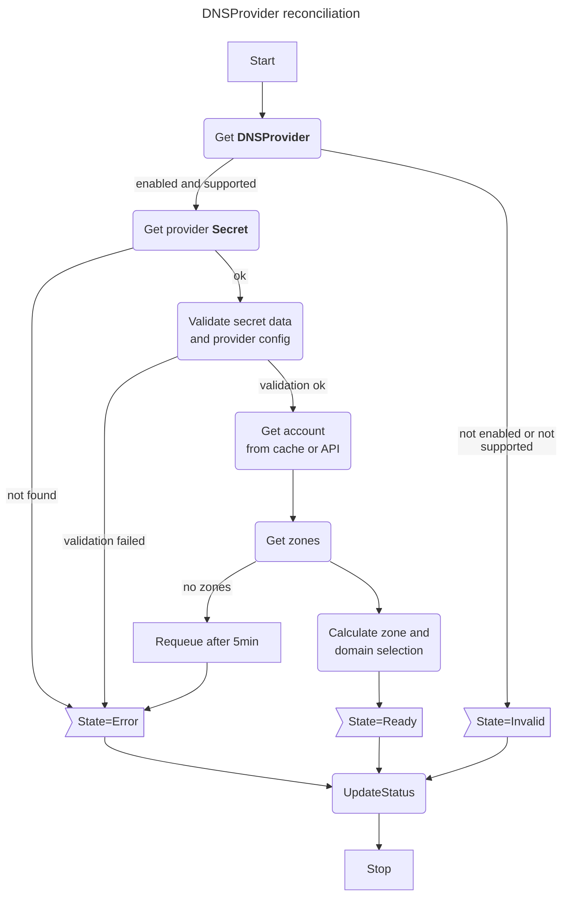

# `DNSProvider` reconciliation

The `reconcile` method in this code is responsible for managing DNS provider configurations with the following key steps:

1. Validates the provider type and checks if it's enabled and supported
2. Retrieves and validates secret references and credentials
3. Sets up DNS account configuration with TTL and rate limits
4. Fetches hosted zones from the DNS provider account
5. Updates the provider state and selection based on zones
6. Updates the `DNSProvider` status with current state, zones, TTL, and rate limits

The method ensures proper configuration and state management of DNS providers while handling error cases and validation.

