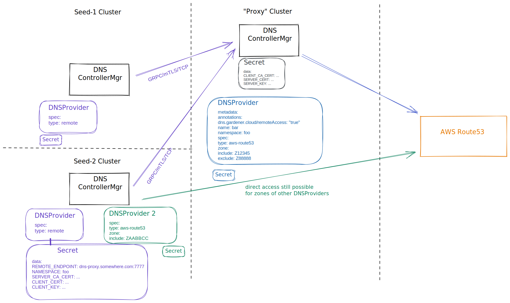

# GEP-Internal: Introduce centralized "Proxy" DNS Controller Manager to reduce requests on infrastructure service (Remote DNSProvider)

## Table of Contents

- [GEP-Internal: Introduce centralized "Proxy" DNS Controller Manager to reduce requests on infrastructure service (Remote DNSProvider)](#gep-internal-introduce-centralized-proxy-dns-controller-manager-to-reduce-requests-on-infrastructure-service-remote-dnsprovider)
  - [Table of Contents](#table-of-contents)
  - [Summary](#summary)
  - [Motivation](#motivation)
    - [Goals](#goals)
    - [Non-Goals](#non-goals)
  - [Proposal](#proposal)
    - [Draft proposal](#draft-proposal)
  - [Alternatives](#alternatives)
    - [Account sharding](#account-sharding)
    - [Don't rely on zone state but use plain DNS lookups](#dont-rely-on-zone-state-but-use-plain-dns-lookups)
    - [Longer sync periods for all zones](#longer-sync-periods-for-all-zones)
  - [Notes](#notes)

## Summary

Currently, every seed talks directly to the DNS infrastructure services like AWS Route53.
As our landscapes keep growing we face a scaling issue because of the hard rate limit at AWS Route53 and the resulting throttling.
A large part of the requests are related to periodic sync of the zone state.
To get rid of the zone state sync per seed, a central DNS controller should be introduced and all seeds use it as caching proxy. Only the central DNS controller execute requests on the infrastructure service for the critical accounts.

## Motivation

Quite a few changes have already been introduced in the past to reduce the number of requests:

- zone state caching
- batching of updates
- asking big stakeholders to use own accounts
- increasing the page size for listing DNS records from 100 to 300 on AWS
- increasing rate limit from 5 to 10 per second for live landscape account
- increasing sync period for internal domain from 30min to 24h
- increasing sync period for default external domain from 30min to 60 min (not yet deployed)
- ~~blocking internal domain~~  did not work out, as seeds are using internal domain also for external DNSProvider
- (`DNSRecords` for internal domain)

But we run out of ideas for further improvements without architectual changes.

The zone state is currently cached in each seed and updated on any changes performed on the seed. Periodically (currently every 30m) the zone state is replaced by the original state from the infrastructure service to synchronize with external changes. For large zones this can involve more than 50 page requests.

If we add another cache level, each seed would talk only to the central cache (with write through). Only the central instance of the DNS controller would communicate with the infrastructure service to read zones and zone states and to apply changes. Instead of N seeds fetching the zone state from the infrastructure service, only the central instance would do it.
Adding new seeds would only add the load caused by creating, updating, or deleting DNS records. The scaling limit would be more related the overall number of shoots and their workload related to DNS changes.
There are typically only a few updates per (hour * account * seed). A small probe on live seeds got values typically between 1 and 5. Even with a very conservative estimation of 35 updates per (hour * account * seed) it should be enough for 500 seeds.

### Goals

Reduce the load on the landscape account on AWS Route53 caused by periodic zone state synchronization of the external domain to allow further seed scale up.

### Non-Goals

For zones provided by a stakeholder, the current distributed access to the infrastructure service is kept. Otherwise it would be needed to replicate the credentials to the central instance.

## Proposal

Add one central DNS controller which handles the zones of the Gardener landscape account solely. The DNS controllers of the dns-external extension on each seed perform all read and write operations through this central instance.

For this purpose a new `DNSProvider` type is introduced: `remote`. All operations on `DNSHandler` level are forwarded to the remote DNS controller. The API for the `DNSHandler` consists only of a few methods.

```protobuf
// GRPC Interface exported by the server.
service RemoteProvider {
  rpc Login(LoginRequest) returns (LoginResponse) {}

  rpc GetZones(GetZonesRequest) returns (Zones) {}

  rpc GetZoneState(GetZoneStateRequest) returns (ZoneState) {}

  rpc Execute(ExecuteRequest) returns (ExecuteResponse) {}
}
```

The credentials (i.e. the `Secret`) of a `remote` `DNSProvider` specifies endpoint, server CA, client certficate and a remote namespace.
The remote namespace of the K8s cluster where the central DNS controller is running can contain one or multiple `DNSProviders` annotated with `dns.gardener.cloud/remoteAccess=true`. All included zones of these `DNSProviders` of the central controller are available to the local `DNSProvider` of type `remote` [1]. The local provider can be restricted by the include/exclude spefication of the `domains` and/or `zones` as usually.

```yaml
apiVersion: dns.gardener.cloud/v1alpha1
kind: DNSProvider
...
spec:
  type: remote
  ...
  # domains:
  # include:
  #  - my.own.domain.com
  # exclude:
  #  - private.own.domain.com
  #zones:
  #  include:
  #  - <ZONEID>
  #  exclude:
  #  - <ZONEID>
```

To secure the connection, the communication uses mTLS. The client certificate could also contain additional authorization information to restrict access to one namespace.



### Draft proposal

see https://github.com/gardener/external-dns-management/pull/228

## Alternatives

### Account sharding

As the AWS Route53 rate limits are per account, we could use multiple accounts and create another default external domain shard.
Note that after the domain name of the shoot is immutable after creation. The domain name is either defaulted by Gardener with  the default external domain or specified in the shoot manifest (`spec.dns.domain`). Using a different account for each seed is therefore in conflict with possible control plane migrations.
Using different account per Gardener project should be more stable. Of course it cannot be changed later. And existing shoot cluster cannot be migrated and have to stay with the unique old default external domain.
If there are multiple accounts, the projects could be assigned to an account automatically by some hash mechanism based on the project id. As it is not clear on project creation time how large it will become in the future, a fair distribution over the accounts may not work out.

### Don't rely on zone state but use plain DNS lookups

As most of the requests are related to the synchronization of the zone state, a "simple" alternative would be if the zone state would not be needed at all.
The zone state is needed on reconciliation of each `DNSEntry` to verify if the specified state is already realized as DNS records.
DNS lookups could be used for the check instead. But only, if the zone is available to the DNS servers used by the nodes of the seeds. The DNS controller seed cannot easily decide itself, if it can lookup the DNS records for a zone, how long the propagation may need, and if the TTL are the original ones. For private zones, the DNS servers must be configured accordingly, and for public zones the DNS server configuration may even block such lookups. Therefore the provider should be marked explicitly if DNS lookup should be used. Even for a user it may not be clear if lookups are possible for the seed.

There will be some delay until the changes applied on the infrastructure service reach the DNS servers used by the seed. So the DNS controller still needs to cache the changes for some minutes and to trust that the changes will reach the DNS servers.
If for any reason the DNS server will not see the changes, the controller is in trouble. At some point in time it will have to make a request to the infrastructure service to verify the state instead. And this may happen periodically and some form of backoff mechanism would be needed to avoid repeated requests.
Additionally for cleanup orphan DNS records a retrieval of the zone state would still be needed periodically to find and delete DNS records which have not deleted when their corresponding DNSEntry was deleted for whatever reasons.

### Longer sync periods for all zones

Currently, the zones are synchronized ever 30m. If we go to e.g. 8h we can reduce the load by a factor 16 (ignoring other effects).
Although it would help during normal operation, the throttling would still be seen on updating the dns-external extension. The update of the `ControllerDeployment` triggers immediate update of all instances on all seeds. The DNS controller needs to read all zone states on startup.
Besides, it may not be possible to delete a shoot and create a new one with the same name within the synchronization period. If the control plane of the old shoot was located on another seed as the new one, the cached zone state of the seed of the new shoot may still contain the outdated DNS records of the former shoot.

## Notes

[1] Domain includes and excludes of a central `DNSProvider` are ignored. Only the effective included zones are considered and are completely accessible for remote access.